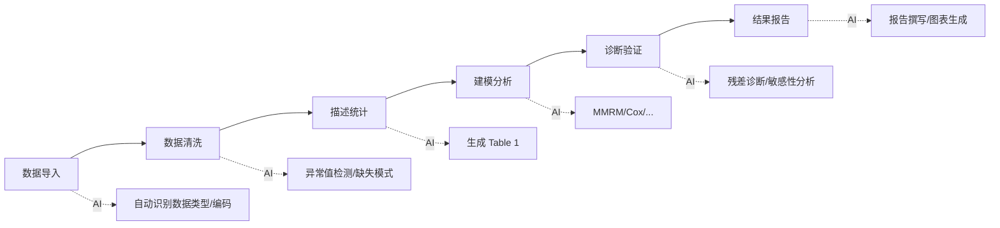

# AI 辅助分析流程

## 端到端 AI 协作分析方案

## 各阶段 AI 使用策略

| 阶段 | AI 角色 | 人工职责 |
|------|---------|---------|
| 数据导入 | 写代码 | 验证数据完整性 |
| 数据清洗 | 标记异常 | 确认处理规则 |
| 描述统计 | 生成 Table | 审核分类合理性 |
| 建模分析 | 实现模型 | 确认 SAP 规范 |
| 诊断验证 | 检查假设 | 专业判断 |
| 结果报告 | 撰写描述 | 确保 regulatory 合规 |

## 最佳实践

- 每轮 AI 对话聚焦一个明确任务
- 对 AI 输出保持**专业怀疑**
- 关键决策（如缺失数据处理方法）不应交给 AI
- 使用版本控制追踪 AI 辅助的分析代码
